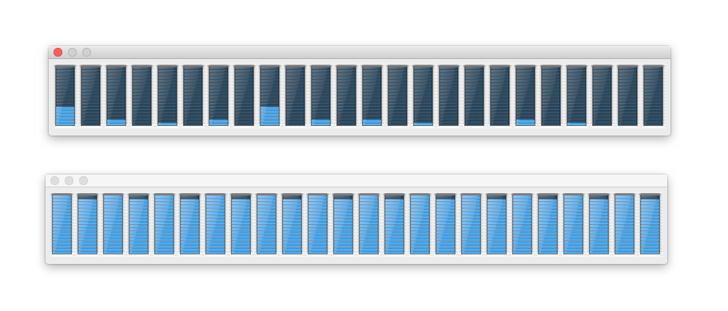

# fifth-postulate

Test ClojureScript parallel compilation speedup.

This project includes a _lot_ of independent namespaces arranged in a flat hierarchy, each of which is a relatively expensive namespace to compile.

## Running

1. Build master of ClojureScript and update the `project.clj` file to refer to it. (Clone https://github.com/clojure/clojurescript, do `script/build`, note the version installed in local Maven repo, and edit the `project.clj` file for `fifth-postulate` to refer to same build number.)
2. Run `lein clean && lein cljsbuild once single` for a regular build.
3. Run `lein clean && lein cljsbuild once parallel` for a parallel build.

## Results

2 x 2.4 GHz 6-Core Intel Xeon Mac Pro with 24 GB RAM:

```
$ lein clean && lein cljsbuild once single
Compiling ClojureScript...
Compiling "/Users/mfikes/Projects/fifth-postulate/target/cljsbuild-main.js" from ["src"]...
Successfully compiled "/Users/mfikes/Projects/fifth-postulate/target/cljsbuild-main.js" in 1450.718 seconds.
```

```
$ lein clean && lein cljsbuild once parallel
Compiling ClojureScript...
Compiling "/Users/mfikes/Projects/fifth-postulate/target/cljsbuild-main.js" from ["src"]...
Successfully compiled "/Users/mfikes/Projects/fifth-postulate/target/cljsbuild-main.js" in 209.565 seconds.
```

That's approximately a 7x speedup.

Here is a comparison of what the CPUs look like for each run


